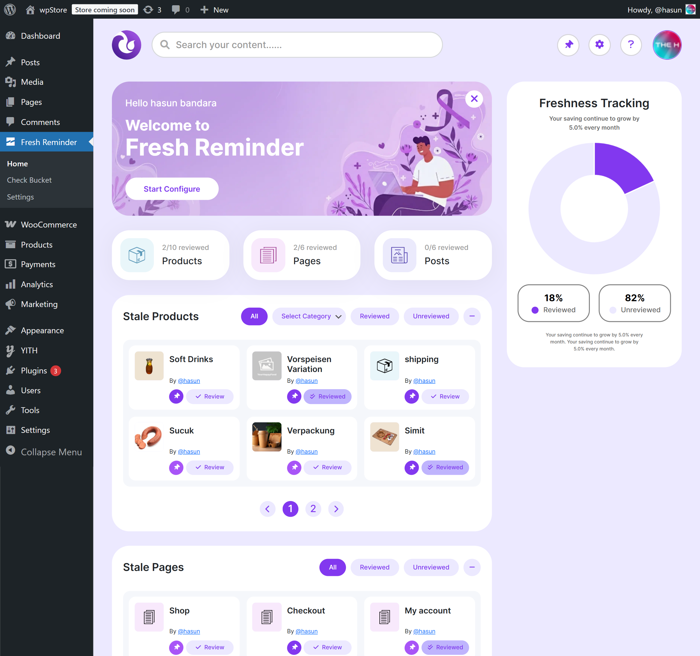
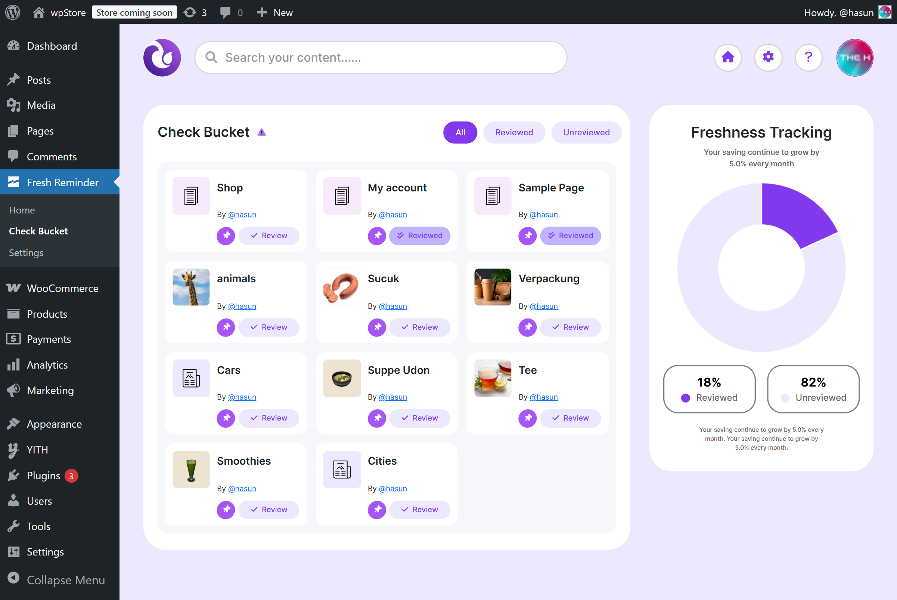
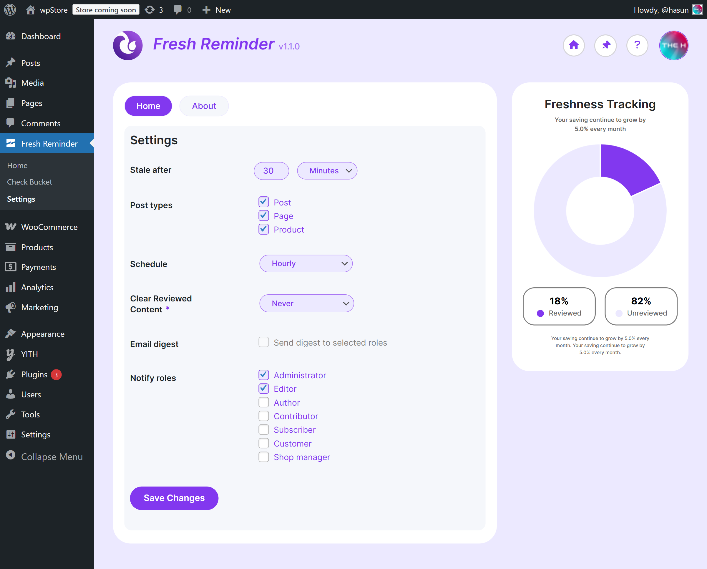

<div align="center">
    
</div>
<br>
<div align="center">
    <a href="https://github.com/hasunB/fresh-reminder/releases/tag/v1.0.0">Release</a> |
    <a href="https://github.com/hasunB/fresh-reminder/releases/download/v1.1.1/fresh-reminder-v1.1.1.zip">Download</a> |
    <a href="https://github.com/hasunB/fresh-reminder/discussions">Discussions</a>
</div>
<br>
<div align="center">
    
    
    
    
    
</div>
<br>
<div align="center">
    <a href="https://github.com/hasunB/fresh-reminder/releases/download/v1.1.1/fresh-reminder-v1.1.1.zip" target="_blank">
      
    </a>
</div>

## Fresh Reminder

A lightweight WordPress plugin that tracks how fresh your posts are and highlights **stale content** in both the frontend and WordPress Admin Dashboard.  

Stay on top of your content updates and keep your site relevant for readers and search engines.
<br>

## Features
- **Content Freshness Tracking**: The plugin tracks the last updated date of your posts to determine their **freshness.** 

- **Status Indicators**: It assigns a status to each post, which is visible in the admin dashboard and on the post itself (as a widget). The primary statuses are: 
  - 🟢 **Reviewd** (Already Reviewed)    
  - 🔴 **Unreviewed** (not updated for given months)  
- Click-to-edit links directly from the dashboard.

- **Dashboard Overview**
  - Displays a complete overview of all posts and their freshness status.
  - Allows quick post editing and updating directly from the dashboard.
  - Dynamic refresh ensures real-time updates after any change.

- **Frontend Widget**: A widget is displayed on the frontend of your site, showing the freshness status of each post to your visitors.

- **Settings Page**: The plugin includes a settings page where you can customize the "unreviewed" threshold (e.g., how many months without an update until a post is marked as unreviewed).

- **Category & Status Filtering**
  - Admins can filter posts by:
  - Post category (e.g., News, Guides, Tutorials).
  - Freshness status (Stale, Reviewed, Unreviwed).
  - Helps quickly isolate content needing updates in specific topics.

- **Search Function**
  - Built-in search bar for quickly locating posts by title, category, or tag.
  - Supports AJAX live search for instant results.

- **Pin to “CheckBucket”**
  - Users can pin specific posts that need manual review or extra attention.
  - Pinned posts are stored in a special collection called the “CheckBucket.”
  - The CheckBucket acts like a temporary bin — perfect for managing content you want to recheck later.
  - Posts can be easily added or removed from the CheckBucket with one click.

- Works out-of-the-box, **no setup required**.  
<br>

## Plugin Structure
```bash
fresh-reminder/
│── assets/
│ └── css/
│ └── images/
│ └── js/
│── includes/
│ └── class-fr-cron.php # Cron job scheduler
│── languages/
│── src/
│ └── Admin/
│   └── pages/
│   └── class-fr-admin.php # Admin dashboard logic
│ └── API/
│ └── Database/
│ └── Frontend/
│ └── Utils/
│── templates/
│── vendor/
│── .gitignore
│── CHANGELOG.md
│── fresh-reminder.php # Main plugin file
│── LICENSE
│── README.md
│── readme.txt
│── uninstall.php
```
<br>

1. Download or clone this repository:  
   ```bash
   git clone https://github.com/hasunB/fresh-reminder.git
   ```
2. Upload the folder to your WordPress `wp-content/plugins/` directory. 

3. Activate Content Freshness Tracker from the WordPress Admin Dashboard → Plugins. 

4. Done! 🎉 Freshness tracking is now enabled.

<br>

## Usage
- Visit **Fresh Reminder** in your WordPress dashboard to see all posts sorted by freshness.

- Visit Table in the dasnboard overview.
<br>

## Screenshots
### 1. Front-end post Widget
<div align="center">
    
</div>
<br>

### 2. Check Bucket
<div align="center">
    
</div>
<br>

### 3. Settings
<div align="center">
    
</div>
<br>
<br>

## Readmap
- Add settings to customize thresholds (e.g., monts).

- Add Gutenberg block sidebar widget with freshness info.

- Add JAX-based real-time freshness dashboard.
<br>

## Contributing
1. Fork the repo

2. Create a feature branch
   ```bash
   git checkout -b feature/your-feature
   ```

3. Commit changes
   ```bash 
   git commit -m "Add your feature"
   ```

4. Push to the branch 
   ```bash
   git push origin feature/your-feature
   ```

5. Open a Pull Request
<br>

## License
This plugin is open-source and available under the [GPL-3.0](./LICENSE). See the LICENSE.md file for details.

