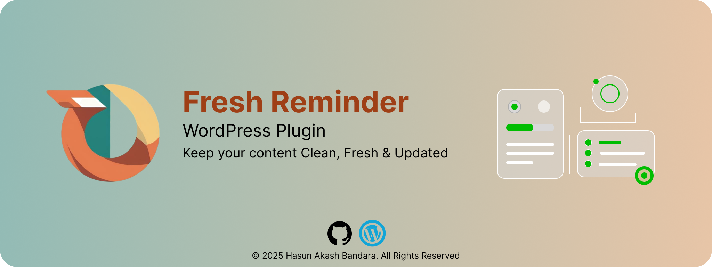
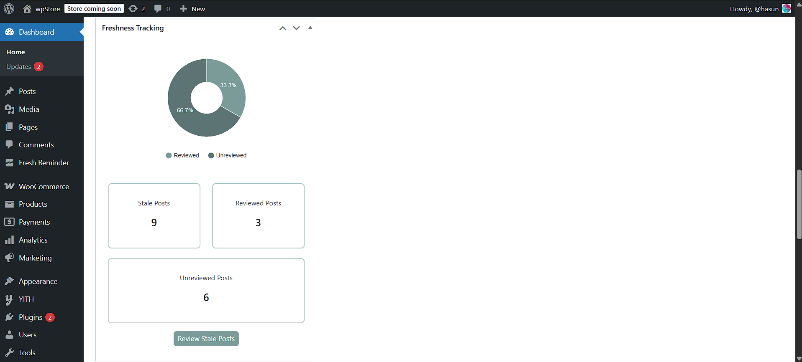
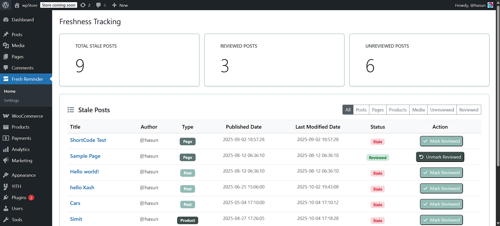
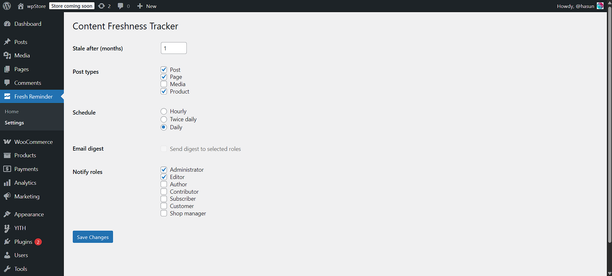

<div align="center">
    
</div>
<br>

<div align="center">
    
    
</div>
<br>

<div align="center">
    <a href="https://github.com/hasunB/fresh-reminder/releases/tag/v1.0.0">Release</a> |
    <a href="https://github.com/hasunB/fresh-reminder/releases/download/v1.0.0/fresh-reminder.zip">Download</a> |
    <a href="">Discussions</a>
</div>
<br>
<div align="center">
    <a href="https://github.com/hasunB/fresh-reminder/releases/download/v1.0.0/fresh-reminder.zip" target="_blank">
      
    </a>
</div>

## Fresh Reminder

A lightweight WordPress plugin that tracks how fresh your posts are and highlights **stale content** in both the frontend and WordPress Admin Dashboard.  

Stay on top of your content updates and keep your site relevant for readers and search engines.
<br>

## Features
- Automatically shows **freshness status** (Stale, Reviewed) on each post. 

- Adds a **dashboard page** listing all posts with freshness indicators.  

- Highlights posts based on last update date:
  - 🟢 **Reviewd** (Already Reviewed)    
  - 🔴 **Stale** (not updated for given months)  
- Click-to-edit links directly from the dashboard.

- Works out-of-the-box, no setup required.  
<br>

## Plugin Structure
```bash
fresh-reminder/
│── fresh-reminder.php # Main plugin file
│── includes/
│ └── class-fr-admin.php # Admin dashboard logic
│ └── class-fr-tracker.php # Frontend freshness tracker
│── assets/
│ └── css/admin.css # Admin styles
│ └── js/admin.js # Admin scripts 
  └── assets/logo.png # plugin logo
```
<br>

1. Download or clone this repository:  
   ```bash
   git clone https://github.com/hasunB/fresh-reminder.git
   ```
2. Upload the folder to your WordPress `wp-content/plugins/` directory. 

3. Activate Content Freshness Tracker from the WordPress Admin Dashboard → Plugins. 

4. Done! 🎉 Freshness tracking is now enabled.

<br>

## Usage
- Visit **Fresh Reminder** in your WordPress dashboard to see all posts sorted by freshness.

- Visit Table in the dasnboard overview.
<br>

## Screenshots
### 1. Front-end post Widget
<div align="center">
    
</div>
<br>

### 2. Admin Dashboard
<div align="center">
    
</div>
<br>

### 3. Tracker settings
<div align="center">
    
</div>
<br>
<br>

## Readmap
- Add settings to customize thresholds (e.g., monts).

- Add Gutenberg block sidebar widget with freshness info.

- Add JAX-based real-time freshness dashboard.
<br>

## Contributing
1. Fork the repo

2. Create a feature branch
   ```bash
   git checkout -b feature/your-feature
   ```

3. Commit changes
   ```bash 
   git commit -m "Add your feature"
   ```

4. Push to the branch 
   ```bash
   git push origin feature/your-feature
   ```

5. Open a Pull Request
<br>

## License
This plugin is open-source and available under the [GPL-3.0](./LICENSE). See the LICENSE.md file for details.

